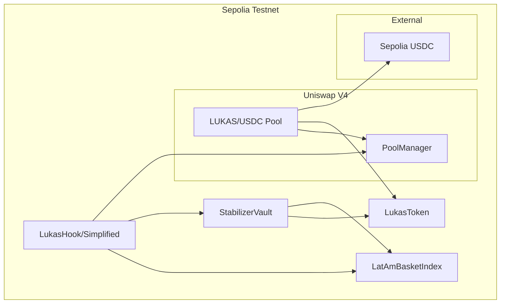

# Design Document: Sepolia Deployment

## Overview

This design document outlines the architecture and implementation plan for deploying the Lukas Protocol contracts to Sepolia testnet, fixing existing test failures, and creating a LUKAS/USDC pool on Uniswap V4. The deployment will enable proper testing of the peg stabilization mechanism before mainnet deployment.

## Architecture



### Deployment Flow

1. Deploy LukasToken with initial supply
2. Deploy mock price feed adapters for testing
3. Deploy LatAmBasketIndex with mock feeds
4. Deploy StabilizerVault linked to LukasToken and LatAmBasketIndex
5. Deploy LukasHookSimplified (or full LukasHook if PoolManager available)
6. Create LUKAS/USDC pool on Uniswap V4
7. Provide initial liquidity
8. Verify all contracts on Etherscan

## Components and Interfaces

### 1. StabilizerVault Test Fix

The current test failures are caused by the cooldown logic. The issue is that `lastStabilization` starts at 0, but the cooldown check `block.timestamp < lastStabilization + cooldownPeriod` fails because `0 + 5 minutes` is less than current block timestamp in tests.

**Fix Strategy:**
- Initialize `lastStabilization` to `block.timestamp - cooldownPeriod` in constructor to allow immediate first action
- OR modify tests to properly handle the initial state

**Recommended Fix (in tests):**
```solidity
function setUp() public {
    // ... existing setup ...
    
    // Warp time forward to ensure cooldown is elapsed from deployment
    vm.warp(block.timestamp + 6 minutes);
}
```

### 2. Network Configuration

**Sepolia Network Details:**
- Chain ID: 11155111
- RPC URL: https://sepolia.infura.io/v3/{API_KEY} or https://rpc.sepolia.org
- Block Explorer: https://sepolia.etherscan.io
- Uniswap V4 PoolManager: `0x8C4BcBE6b9eF47855f97E675296FA3F6fafa5F1A` (official Sepolia deployment)

**Sepolia USDC (Test Token):**
- Address: `0x1c7D4B196Cb0C7B01d743Fbc6116a902379C7238` (Circle's official Sepolia USDC)

### 3. Deployment Scripts

Create new deployment scripts for Sepolia:

```solidity
// script/DeploySepoliaAll.s.sol
contract DeploySepoliaAll is Script {
    function run() external {
        // 1. Deploy LukasToken
        // 2. Deploy mock price feeds
        // 3. Deploy LatAmBasketIndex
        // 4. Deploy StabilizerVault
        // 5. Deploy LukasHookSimplified
        // 6. Configure permissions
    }
}
```

### 4. Uniswap V4 Pool Creation

**Pool Configuration:**
- Token0: LUKAS (sorted by address)
- Token1: USDC (sorted by address)
- Fee: 3000 (0.3%)
- Tick Spacing: 60
- Initial Price: ~$0.10 USDC per LUKAS (based on LatAm basket)
- Hook: LukasHook address (or zero address for simplified testing)

**sqrtPriceX96 Calculation:**
For price of 0.10 USDC per LUKAS:
```
sqrtPriceX96 = sqrt(0.10) * 2^96 = 0.316... * 79228162514264337593543950336
             ≈ 25054144837504793118641380352
```

## Data Models

### deployments.json Structure (Sepolia Addition)

```json
{
  "networks": {
    "11155111": {
      "name": "Sepolia Testnet",
      "chainId": 11155111,
      "rpcUrl": "https://rpc.sepolia.org",
      "blockExplorer": "https://sepolia.etherscan.io",
      "contracts": {
        "stable": {
          "LukasToken": {
            "address": null,
            "deployedAt": null,
            "deployer": null,
            "version": "1.0.0",
            "verified": false,
            "status": "not-deployed"
          },
          "LatAmBasketIndex": {
            "address": null,
            "deployedAt": null,
            "deployer": null,
            "version": "1.1.0",
            "verified": false,
            "status": "not-deployed"
          },
          "StabilizerVault": {
            "address": null,
            "deployedAt": null,
            "deployer": null,
            "version": "1.0.0",
            "verified": false,
            "status": "not-deployed"
          },
          "LukasHook": {
            "address": null,
            "deployedAt": null,
            "deployer": null,
            "version": "1.0.0-simplified",
            "verified": false,
            "status": "not-deployed"
          },
          "USDC": {
            "address": "0x1c7D4B196Cb0C7B01d743Fbc6116a902379C7238",
            "version": "external",
            "verified": true,
            "status": "stable",
            "note": "Circle's official Sepolia USDC"
          },
          "UniswapV4PoolManager": {
            "address": "0x8C4BcBE6b9eF47855f97E675296FA3F6fafa5F1A",
            "version": "external",
            "verified": true,
            "status": "stable",
            "note": "Official Uniswap V4 PoolManager on Sepolia"
          }
        }
      }
    }
  }
}
```

## Correctness Properties

*A property is a characteristic or behavior that should hold true across all valid executions of a system-essentially, a formal statement about what the system should do. Properties serve as the bridge between human-readable specifications and machine-verifiable correctness guarantees.*

### Property 1: Cooldown Enforcement After Action
*For any* StabilizerVault instance, after a successful stabilizeMint or stabilizeBuyback call, any subsequent call within the cooldown period SHALL revert with CooldownNotElapsed error.
**Validates: Requirements 1.4**

### Property 2: First Stabilization Succeeds
*For any* newly deployed StabilizerVault, the first stabilizeMint call with valid parameters SHALL succeed without cooldown restriction.
**Validates: Requirements 1.1, 1.2**

### Property 3: Hook Permission Consistency
*For any* LukasHook deployment, the getHookPermissions() return value SHALL have beforeInitialize=true and afterSwap=true, with all other permissions set according to the hook's design.
**Validates: Requirements 6.1**

### Property 4: Pool Token Validation
*For any* pool initialization attempt through LukasHook, the hook SHALL revert with InvalidPool if the pool does not contain both LUKAS and USDC tokens.
**Validates: Requirements 6.2**

### Property 5: Price Deviation Calculation
*For any* pool price and fair price, the calculateDeviation function SHALL return a deviation in basis points where positive values indicate over-peg and negative values indicate under-peg.
**Validates: Requirements 6.3, 6.4**

### Property 6: Stabilization Trigger Threshold
*For any* price deviation, shouldStabilize SHALL return true only when the absolute deviation exceeds the configured deviationThreshold AND the cooldown has elapsed.
**Validates: Requirements 6.5**

## Error Handling

### Contract Errors

| Error | Condition | Resolution |
|-------|-----------|------------|
| `CooldownNotElapsed` | Stabilization called before cooldown | Wait for cooldown period |
| `ExceedsMaxMint` | Mint amount > maxMintPerAction | Reduce mint amount |
| `ExceedsMaxBuyback` | Buyback amount > maxBuybackPerAction | Reduce buyback amount |
| `InsufficientCollateral` | Not enough LUKAS for buyback | Deposit more LUKAS |
| `Unauthorized` | Caller not authorized | Use authorized address |
| `InvalidPool` | Pool doesn't contain LUKAS/USDC | Use correct token pair |

### Deployment Errors

| Error | Condition | Resolution |
|-------|-----------|------------|
| Insufficient gas | Not enough ETH for deployment | Add more Sepolia ETH |
| Verification failed | Source code mismatch | Check compiler settings |
| Hook address validation | Hook address doesn't match permissions | Use CREATE2 with correct salt |

## Testing Strategy

### Dual Testing Approach

This implementation uses both unit tests and property-based tests:

1. **Unit Tests**: Verify specific examples and edge cases
2. **Property-Based Tests**: Verify universal properties across random inputs

### Property-Based Testing Framework

**Framework**: Foundry's built-in fuzz testing with `forge-std`

**Configuration**:
```toml
[fuzz]
runs = 256
max_test_rejects = 65536
```

### Test Categories

#### 1. StabilizerVault Tests (Fix Required)

```solidity
// Test cooldown from fresh deployment
function test_FirstStabilizationSucceeds() public {
    // Deploy fresh vault
    // Call stabilizeMint immediately
    // Should succeed
}

// Test cooldown enforcement
function testFuzz_CooldownEnforced(uint256 waitTime) public {
    // Bound waitTime to reasonable range
    // First stabilization
    // Wait waitTime
    // Second stabilization should fail if waitTime < cooldown
}
```

#### 2. Hook Permission Tests

```solidity
function test_HookPermissions() public {
    Hooks.Permissions memory perms = hook.getHookPermissions();
    assertTrue(perms.beforeInitialize);
    assertTrue(perms.afterSwap);
}
```

#### 3. Integration Tests

```solidity
function test_PoolCreationWithHook() public {
    // Create pool with LukasHook
    // Verify hook is called on initialize
    // Verify hook is called on swap
}
```

### Gas Estimation

**Estimated Deployment Costs (Sepolia):**

| Contract | Estimated Gas | @ 20 gwei |
|----------|--------------|-----------|
| LukasToken | ~800,000 | 0.016 ETH |
| LatAmBasketIndex | ~1,500,000 | 0.030 ETH |
| Price Feed Adapters (5x) | ~500,000 each | 0.050 ETH |
| StabilizerVault | ~1,200,000 | 0.024 ETH |
| LukasHookSimplified | ~600,000 | 0.012 ETH |
| Pool Initialization | ~300,000 | 0.006 ETH |
| Liquidity Provision | ~400,000 | 0.008 ETH |
| **Total** | ~5,800,000 | **~0.146 ETH** |

**Conclusion**: 0.5 Sepolia ETH is sufficient with ~0.35 ETH buffer for verification and additional transactions.

### Test Annotations

Each property-based test MUST include:
```solidity
/// @notice **Feature: sepolia-deployment, Property 1: Cooldown Enforcement After Action**
/// **Validates: Requirements 1.4**
function testFuzz_CooldownEnforcedAfterAction(uint256 waitTime) public {
    // Test implementation
}
```
